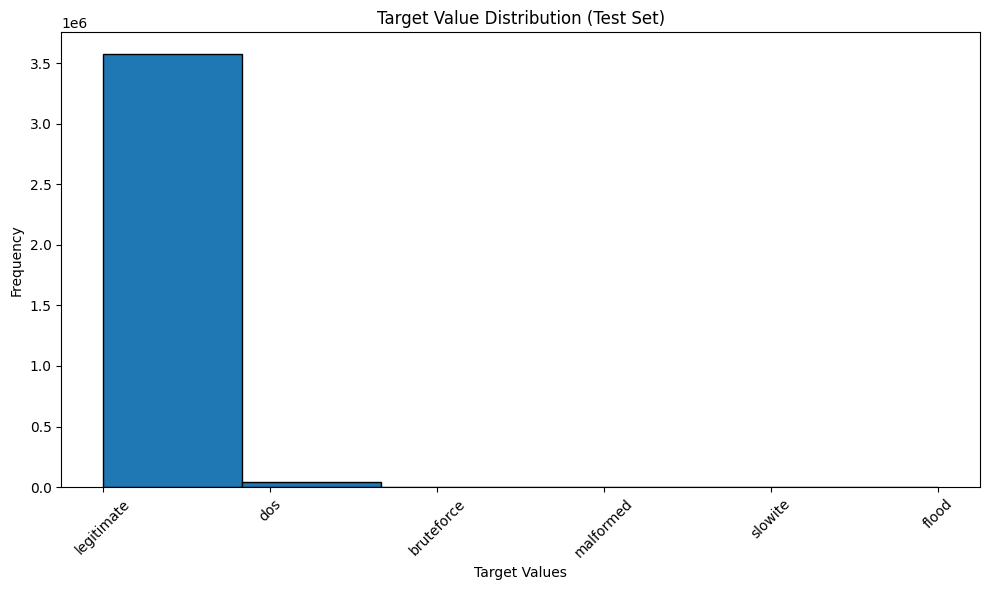

# Systems and Toolchains Project Option 2: Data Option 2
This will walk you through the required tasks and subtasks to complet the Course Project for Jonathan Roberts in the 14-763 Systems and Toolchains course at Carnegie Mellon University

# Task 1
- [x] Ingest both train and test data into one Postgres Database table. As per the class announcement, I am using the train70 and test30 data in Final CSV folder.
    - This is accomplished in cells 1, 2, and 3 and separated that way for modularity
    - Link to Google Drive [data folder](https://drive.google.com/drive/u/0/folders/1mqoPMrIW_rw10Fg_si67ebqfjUIsjLCa)
- [x] Add a field to your database table that distinguishes between train and test
datasets.
    - This is accomplished in cell 3
- [x] Your tables should be created in schema with the name “mqtt”.
    - Accomplished in cell 3 using Spark's overwrite mode
- [x] In your README.md, add a description of the features in the dataset.

# Analysis of MQTTset Dataset Features

The **MQTTset** dataset from Kaggle was simulated to create a Machine Learning dataset that would be capable of analyzing and detecting anomalies or intrusions within the popular IoT communications protocol MQTT. 

Below is a detailed description of the features in the dataset, organized logically into groups related to the MQTT protocol and other network features.


## MQTT Protocol-Related Features

These features are directly associated with the MQTT protocol and provide insights into the specifics of MQTT communication.

### Connection Establishment Features

1. **`mqtt.ver`** *(Integer)*  
   The version of the MQTT protocol being used.
    - probably not useful, unless different versions are more susceptible to attacks, but doubtful that's determinable in the dataset

2. **`mqtt.protoname`**  
   The name of the MQTT protocol
   - gotta be worthless

3. **`mqtt.proto_len`**  
   The length of the MQTT protocol name.
   - gotta be worthless

4. **`mqtt.conflags`** 
   Connection flags set in the CONNECT message, representing various options in a single byte.

5. **`mqtt.conflag.cleansess`**   
   Clean Session flag indicating if the server should discard previous session information (`1` for true).

6. **`mqtt.conflag.willflag`**  
   Will Flag indicating if a Will message is included in the CONNECT message (`1` for true).
   - gotta be worthless

7. **`mqtt.conflag.qos`**  
   Quality of Service level for the Will message:
   - `0`: At most once
   - `1`: At least once
   - `2`: Exactly once

8. **`mqtt.conflag.retain`**  
   Will Retain flag indicating if the Will message should be retained by the broker (`1` for true).
   - gotta be worthless

9. **`mqtt.conflag.uname`**  
   Username Flag indicating if a Username is present in the CONNECT message (`1` for true).

10. **`mqtt.conflag.passwd`** 
    Password Flag indicating if a Password is present in the CONNECT message (`1` for true).

11. **`mqtt.conflag.reserved`** 
    Reserved bit in the CONNECT flags, should be `0`.
   - gotta be worthless

12. **`mqtt.kalive`**  
    Keep Alive timer, maximum interval in seconds between messages to keep the connection alive.

### CONNACK Message Features

13. **`mqtt.conack.val`**   
    The return code in the CONNACK message indicating the result of the connection attempt:
    - `0`: Connection Accepted
    - Non-zero values indicate various connection errors.

14. **`mqtt.conack.flags`**  
    Connection Acknowledgment flags in the CONNACK message.
    - Possibly useful but unlikely

15. **`mqtt.conack.flags.sp`**  
    Session Present flag in the CONNACK message indicating if a session is present (`1` for true).

16. **`mqtt.conack.flags.reserved`** 
    Reserved bits in the CONNACK flags, should be `0`.
   - gotta be worthless

### Message Publishing and Subscription Features

17. **`mqtt.msgtype`**  
    Indicates the type of MQTT message, represented as an integer:
    - `1`: CONNECT
    - `2`: CONNACK
    - `3`: PUBLISH
    - `4`: PUBACK
    - `5`: PUBREC
    - `6`: PUBREL
    - `7`: PUBCOMP
    - `8`: SUBSCRIBE
    - `9`: SUBACK
    - `10`: UNSUBSCRIBE
    - `11`: UNSUBACK
    - `12`: PINGREQ
    - `13`: PINGRESP
    - `14`: DISCONNECT

18. **`mqtt.msgid`**  
    Message Identifier used for messages that require acknowledgment
   - gotta be worthless

19. **`mqtt.qos`** 
    Quality of Service level for the message:
    - `0`: At most once
    - `1`: At least once
    - `2`: Exactly once

20. **`mqtt.retain`**  
    Retain flag indicating if the message should be retained by the broker (`1` for true).
    - Probably worthless, but an attacker wouldn't want the message retained so could possibly be useful

21. **`mqtt.dupflag`** 
    Duplicate delivery flag indicating if the message is a retransmission of an earlier attempt (`1` for true).
    - Probably worthless, but an attacker would want the message to get through if it didn't previously so could possibly be useful

22. **`mqtt.msg`**  
    The payload of the MQTT message.
    - Possibly some useful bits if they differ from the normal sensor messages, but will greatly increase dimensionality if OHE

23. **`mqtt.len`**  
    Remaining length field indicating the number of bytes remaining within the current MQTT packet.
    - Gotta be worthless

24. **`mqtt.sub.qos`** 
    Requested QoS level in a SUBSCRIBE message.

25. **`mqtt.suback.qos`**  
    Granted QoS level in a SUBACK message.

26. **`mqtt.hdrflags`**   
    MQTT header flags providing additional control information, combining `dup`, `QoS`, and `retain` flags.
    - Meaning the dup, QoS and retain flags can possibly be eliminated to streamline the dataset.

### Will Message Features

27. **`mqtt.willmsg`**  
    The Will Message payload that is published by the broker if the client disconnects unexpectedly.
    - Gotta be worthless

28. **`mqtt.willmsg_len`**  
    Length of the Will Message in bytes.
    - Gotta be worthless

29. **`mqtt.willtopic`**  
    The topic name for the Will Message.
    - Gotta be worthless

30. **`mqtt.willtopic_len`**  
    Length of the Will Topic in bytes.
    - Gotta be worthless

## Other Network Features

These features provide additional context about the network traffic and are probably the most useful for analyzing patterns and detecting anomalies.

### TCP Protocol Features

1. **`tcp.flags`**  
   Flags set in the TCP header indicating the state of the connection (e.g., SYN, ACK, FIN). Represented as a bitmask.

2. **`tcp.time_delta`** 
   The time difference in seconds between the current and previous TCP packet in the same session.

3. **`tcp.len`**   
   The length of the TCP segment in bytes, excluding headers.

### Security Feature

4. **`target`**  
   Label indicating if the packet is malicious (`1`) or benign (`0`).

- [x] In this specific dataset, would it be better to use a NoSQL database (e.g., Neo4J)
over PostgreSQL?

# Discussion: NoSQL Database vs. PostgreSQL for the MQTTset Dataset

## Understanding the Dataset
The MQTTset dataset contains structured network traffic data with specific features related to the MQTT protocol. The dataset is natively tabular though I suppose so are most; however, this data  specifically records an event on the IoT network and each event has associated attributes. These attributes are specific to and describe the event rather than describe relationships across various events or types of events as you might see in a graph. As such, there also would not be many collections of nodes to traverse from a center as the data is coming only from 8 sensors and toward 1 broker, while you could possibly set up 8 sensors and give many different IDs to the events, you would ultimately be forcing inherently tabular data into a graph format.

Therefore, PostgreSQL is the natural choice in this case over Neo4J. Though it was not asked, an additional measure you might consider is a Wide-Column store for high throughput especially if you were streaming IoT events.

## Task II: Conduct Analytics on the dataset
Develop functions that run on Spark to answer the following questions, and ingest all data from Postgres before answering the questions:

1. What is the average length of an MQTT message captured in the training (or
testing) dataset for a given target X?
- [x] X is a variable that represents potential value from the target column (e.g.,
legitimate, dos, etc.)
- [x] Use an input parameter (function argument) to identify whether the analysis is conducted on the training dataset or the testing dataset.

Below is the python function followed by output
```python
def get_average_len(df, set='test', target=None)

print(f"Average MQTT message length is: {get_average_len(mqtt_df, target='dos'):.2f}")
```
- Output:
[Stage 28:>                                                         (0 + 1) / 1]
Average MQTT message length is: 85.53

2. For each target value, 
Below is the python function followed by output
```python
def get_average_len(df, set='test', target=None)

ans = get_all_avg_tcp_len(mqtt_df)
keys = ans.keys()
for key in keys:
    print(f"Average TCP message length for target value {key} is: {ans[key][0]:.2f} \n and the most popular header value for {key} is: {ans[key][1]}")
```
- Output: Printed, function returns dictionary of tuples

1) what is the average length of TCP messages and 
- Average TCP message length for target value **slowite is: 1.34** 
- Average TCP message length for target value **bruteforce is: 1.51 **
- Average TCP message length for target value **flood is: 4.82 **
- Average TCP message length for target value **malformed is: 1.79** 
- Average TCP message length for target value **dos is: 2.42 **
- Average TCP message length for target value **legitimate is: 1.97 **

2) what is the most popular header flags’ code (mqtt.hdrflags)?
 - and the most popular header value for **slowite is: 0**
 - and the most popular header value for **bruteforce is: 0x00000010**
 - and the most popular header value for **flood is: 0x00000030**
 - and the most popular header value for **malformed is: 0x00000030**
 - and the most popular header value for **dos is: 0x00000040**
 - and the most popular header value for **legitimate is: 0x00000030**

- [x] Conduct this process programmatically and don’t hardcode any of the target values in your command

3. What is the most frequent X TCP flags for traffic with TCP time delta that is smaller than or equal to Y.
- [X] X represents a positive integer. Handle scenarios where a user may send
negative values to your function.
- [X] Y represents a float value between 0.0 and 5.0.
- [X] Make sure to handle this scenario as well: if the user requests 5 most frequent TCP flags but there are 3 Flags that share the same count at rank number 5, please include all of them in your output.
- Output: Printed, function returns dictionary of tuples
```python
def get_most_frequent_flags(df, X: int, Y: float):
    if 0 >= X:
        raise ValueError("X must be a positive integer.")
    if not (5.0 >= Y >= 0.0):
        raise ValueError("Y must be a float between 0.0 and 5.0.")
    
flags = get_most_frequent_flags(mqtt_df, X=4, Y=.003)
print('The most frequenXt flags for tcp_time_delta < Y are:')
for flag in flags:
    print(f'{flag}') 
```

4. Show a histogram for the target values in the training, testing or combined
dataset.
- [x] Your code should accept an argument that defines if the histogram is
shown for the training, testing or combined.
- [x] Display all three histograms in README

Test Data:


Train Data:


Combined Data:


# Bonus CloudSQL
To get the SparkSession inside the Jupyter Notebook connected to the PostgreSQL instance hosted on Google Cloud's CloudSQL managed database service, you really only need an updated postgresql JAR file that connects Spark to postgres through a JDBC connector. The latest JAR for the PostgreSQL 15 that I used on CloudSQL is the postgres-42.7.4.jar that you see below. Additionally, after the python codeblock, you will see the bash code block. This contains the code that you can copy and paste into your Linux terminal to get the cloud_sql_proxy executable and run that executable to provide a connection that you can point your Spark to through your machine's localhost. **Note: be sure to point to your Google Cloud Project's specific instance rather than mine** As you will see back in the Python code block, I have pointed the SparkSession to jdbc:postgresql://127.0.0.1:5432/postgres' in the JDBC_URL variable. And that's it, it's really not difficult despite days and days of fighting to find this solution.

```py
import pyspark
from pyspark.sql import SparkSession
from pyspark.sql.functions import lit 


# Define dataset, spark constants
APPNAME = 'Roberts_Systool_Project'
MASTER = 'yarn'
JDBC_JAR_PATHS = [
    "home/jroberts1187/course-project-option-2-aitechroberts/postgresql-42.7.4.jar",
]

# JDBC_URL = 'jdbc:postgresql://104.196.99.150:5432/projectdb' CloudSQL URL
'''
Point all nodes (master and workers) to local host to run through each of their own CloudSQL Proxies
'''
JDBC_URL = 'jdbc:postgresql://127.0.0.1:5432/postgres'
DB_PROPERTIES = {
    "user": "postgres",
    "password": "postgres_pw",
    "driver": "org.postgresql.Driver",
    "batchsize": "10000" # trying to optimize the write and seems to have cut the time in half
}

# Initialize Spark session with PostgreSQL JDBC driver
spark = SparkSession.builder \
    .appName(APPNAME) \
    .master(MASTER) \
    .config('spark.jars',JDBC_JAR_PATHS[0]) \
    .config("spark.executor.memory", "8g") \
    .config("spark.driver.memory", "8g") \
    .config("spark.serializer", "org.apache.spark.serializer.KryoSerializer") \
    .config("spark.kryoserializer.buffer.max", "512m") \
    .getOrCreate()
```

```bash
wget https://dl.google.com/cloudsql/cloud_sql_proxy.linux.amd64 -O cloud_sql_proxy
chmod +x cloud_sql_proxy
./cloud_sql_proxy -instances=systool-436201:us-east1:projectdb=tcp:5432 &
```

# Task 3: Machine Learning Modeling
As the MQTT Dataset, even after the elimination based on unique value count, elimination of redundant data from the data descriptions, and correlation considerations (none dropped here actually), and eliminating the mqtt_msg column because my 8 core 32gb environment kept crashing was still (20,000,000, 12), I knew that I need some of the most computationally inexpensive models. Therefore, I chose 2 models with a linear scaling big O notation of O(N * D * T) where N is the number of observations, D is the number of features, and T is the number of iterations. The iterations is important because that's one of the most normal "go-to" hyperparameters to tune. With that in mind, I chose Multinomial Logistic Regression and Multinomial Naive Bayes.

For the LR hyperparameters, I chose the regularization parameter and the number of iterations as these are generally the first hyperparameters usually chosen to tune a model. In logistic regression, coefficients represent the influence of each feature on the prediction. Large coefficients indicate strong influence, while smaller coefficients suggest a weaker influence. So tuning the regularization parameter penalizes large coefficients making the model less sensitive to individual features which serves to prevent over- or underfitting. And tuning the number of iterations on which the model can learn increases the odds that it improves.

For the NB hyperparameter, I chose the smoothing parameter. Without smoothing, if a given feature's probability is ever zero, it will basically eliminate the probability calculation for that feature, making predictions unreliable. Smoothing mitigates this by adding a small constant to the counts of features to guarantee that no feature has a zero probability. The smoothing parameter controls the size of this constant. A larger smoothing value distributes probability more evenly across all features and reducing the influence of a single feature. While a smaller smoothing values allows stronger comparzitve feature influence making it more sensitive to the training data. Smoothing also helps the model generalize beyond training data.

### SparkML Multinomial Linear Regression:
Best Model Parameters: regParam=0.1, maxIter=5  
- *In the interest of time, these parameters were not run in true 'grid' format, and thus only 3 HP combinations were used.
Best Test Accuracy: 0.7311
                                                                                
Confusion Matrix:

Predicted      0.0     1.0     2.0     3.0     4.0     5.0

Actual    
- 0.0        3000000       0       0       0       0       0
- 1.0         225759  254753       0       0     172  119316
- 2.0         169298     127  430275       0      75     225
- 3.0         357600       0       0  237600    1200    3600
- 4.0         214260   49500    4440       0  187680  144120
- 5.0         323175     525       0       0      75  276225

Label Index to Original Target Mapping:
- 0.0: legitimate
- 1.0: bruteforce  42% correct, 38% falsely legitimate (false negative), 20% wrongly labeled
- 2.0: dos         72% correct, 28% falsely legitimate (false negative), <1% wrongly labeled
- 3.0: flood       40% correct, 60% falsely legitimate (false negative), <1% wrongly labeled
- 4.0: malformed   31% correct, 36% falsely legitimate (false negative), 33% wrongly labeled
- 5.0: slowite     46% correct, 54% falsely legitimate (false negative), <1% wrongly labeled


### SparkML Multinomial Naive Bayes:
Best Model Parameters: smoothing=1.0

Best Test Accuracy: 0.7291        

Confusion Matrix:

Predicted      0.0     1.0     2.0     3.0     4.0     5.0

Actual    
- 0.0        3000000       0       0       0       0       0
- 1.0         225759  254925       0       0       0  119316
- 2.0         169298     202  430275       0       0     225
- 3.0         336000    1200       0  259200       0    3600
- 4.0         214260   83400    2160       0  153840  146340
- 5.0         323175     525       0       0      75  276225

Label Index to Original Target Mapping:
- 0.0: legitimate
- 1.0: bruteforce  42% correct, 38% falsely legitimate (false negative), 20% wrongly labeled
- 2.0: dos         72% correct, 28% falsely legitimate (false negative), <1% wrongly labeled
- 3.0: flood       43% correct, 56% falsely legitimate (false negative), <1% wrongly labeled
- 4.0: malformed   25% correct, 36% falsely legitimate (false negative), 39% wrongly labeled
- 5.0: slowite     46% correct, 54% falsely legitimate (false negative), <1% wrongly labeled


